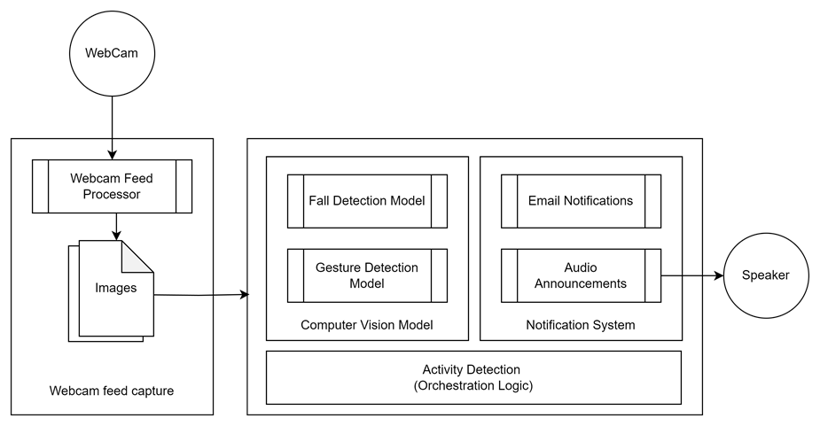
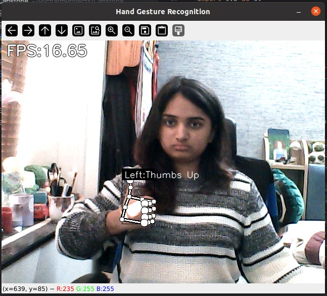
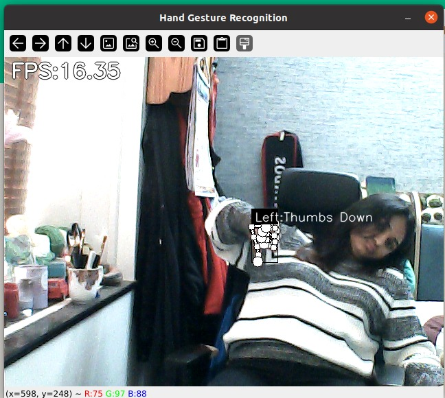
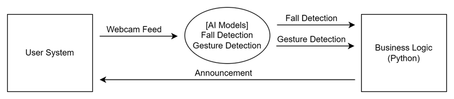
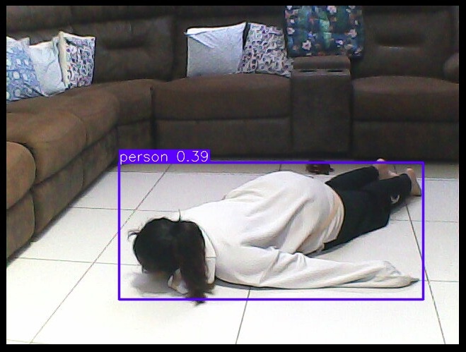
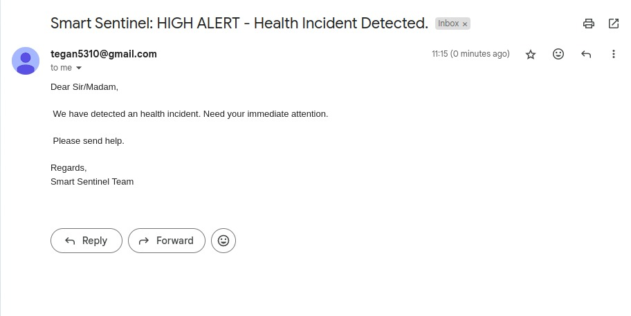

# 🛡️ Smart Sentinel AI

### Real-Time Fall Detection with Gesture-Based Confirmation and Emergency Alerts

**Smart Sentinel** is an AI-powered computer vision safety prototype that monitors a live camera feed, detects potential falls, allows the user to respond with hand gestures, and triggers an alert when assistance is required.

The project combines **YOLOv5s** for person detection, a trained **TensorFlow/Keras fall-classification model**, **MediaPipe** for hand landmark detection, and a Python orchestration layer that handles audio feedback and email notifications.

<p align="center">
  
</p>

---

## ✨ Key Features

- 🎥 Real-time webcam monitoring
- 👤 Person detection using **YOLOv5s**
- 🧠 Fall / standing / sitting classification using a trained **Keras model**
- 📊 Temporal fall verification using a **60-frame rolling buffer**
- ✋ Hand-gesture recognition using **MediaPipe**
- 👍 Thumbs-up acknowledgement
- 👎 Thumbs-down assistance request
- 🔊 Audio feedback for different system states
- 📧 Email alert through Gmail SMTP
- 🧩 Modular Python components for detection, gestures, and notifications

---

## 🎯 Problem

Traditional camera-based monitoring can identify an event only when a person is actively watching the footage. Smart Sentinel explores an automated approach in which computer vision continuously analyses the video feed and combines detection with a user-response mechanism.

The project was developed with applications such as **elderly care, assisted living, healthcare/rehabilitation environments, workplaces, and other monitored spaces** in mind.

---

## 🧠 How It Works

```text
                ┌──────────────────┐
                │   Webcam Feed    │
                └────────┬─────────┘
                         │
                         ▼
                ┌──────────────────┐
                │     YOLOv5s      │
                │  Person Detection│
                └────────┬─────────┘
                         │
                    Person Crop
                         │
                         ▼
                ┌──────────────────┐
                │  Keras Fall      │
                │  Classification  │
                └────────┬─────────┘
                         │
              ┌──────────┼──────────┐
              ▼          ▼          ▼
            Fall    Walking/Standing Sitting
              │
              ▼
        60-Frame Buffer
              │
         ≥ 48 Fall Frames
              │
              ▼
       ┌───────────────┐
       │ Fall Confirmed│
       └───────┬───────┘
               │
               ▼
      ┌───────────────────┐
      │  Gesture Response │
      │    MediaPipe      │
      └─────────┬─────────┘
                │
          ┌─────┴─────┐
          ▼           ▼
     👍 Thumbs Up  👎 Thumbs Down
          │           │
          ▼           ▼
       All Okay    Request Help
                      │
                      ▼
                🔊 Audio Alert
                      │
                      ▼
                📧 Email Alert
```

The capstone report describes the system as a webcam/feed processor, computer-vision models for fall and gesture detection, an orchestration layer, and a notification system.

---

## 🔍 Fall Detection

Smart Sentinel uses a two-stage vision pipeline.

### 1. Person Detection

YOLOv5s is used to detect people in the camera frame. The current implementation restricts detections to the **person** class.

### 2. Fall Classification

The detected person is cropped and resized to **128 × 128** before being passed to the trained Keras model.

The implemented classifier uses three classes:

| Class | Meaning |
|---:|---|
| `0` | Fall |
| `1` | Walking / Standing |
| `2` | Sitting |

### Temporal Verification

A single-frame prediction is not immediately treated as a confirmed fall.

The system stores the most recent **60 frame-level predictions** and confirms a fall when at least **48 frames** in that window are classified as a fall.

```text
48 / 60 = 80%
```

This provides a simple temporal filtering mechanism for the live stream.

---

## ✋ Gesture-Based Response

After a fall is confirmed, Smart Sentinel uses **MediaPipe Hands** together with a trained keypoint classifier to recognize hand gestures.

<div align="center">
  
  
</div>

### 👍 Thumbs Up

A thumbs-up response indicates that the person is okay. The system plays the acknowledgement audio and resets the current incident state.

### 👎 Thumbs Down

A thumbs-down response requests assistance and starts the emergency notification flow.

---

## 🚨 Alert Flow

```text
Fall Confirmed
      │
      ▼
Confirmation Audio
      │
      ▼
Wait for User Response
      │
      ├── 👍 Thumbs Up
      │       │
      │       ▼
      │   Reset / No Alert
      │
      └── 👎 Thumbs Down
              │
              ▼
         Help Requested
              │
              ▼
        Emergency Audio
              │
              ▼
         Email Notification
```

The current implementation sends email through **Gmail SMTP**. Email credentials should be supplied through environment variables and must never be committed to the repository.

---

## 🔊 Audio Feedback

The project includes three audio responses:

| File | Purpose |
|---|---|
| `confirming.wav` | Fall confirmation |
| `ignoring.wav` | User indicates they are okay |
| `sendinghelp.wav` | Help / emergency response |

---

## 🧩 Technology Stack

| Technology | Purpose |
|---|---|
| **Python** | Core application and orchestration |
| **OpenCV** | Webcam capture and image processing |
| **YOLOv5s** | Person detection |
| **TensorFlow / Keras** | Fall classification |
| **VGG16** | Architecture used by the trained fall model described in the project report |
| **MediaPipe** | Hand landmark detection |
| **NumPy** | Numerical/image processing |
| **PyDub** | Audio playback |
| **SMTP / Gmail** | Email notification |
| **Jupyter Notebook** | Model experimentation and training work |

---

## 🏗️ Architecture

<p align="center">
  
</p>

The system is organized around three main stages:

**Detection** → identify and classify the activity from the video frame.

**Orchestration** → combine fall and gesture results and decide what action to take.

**Notification** → provide audio feedback and send an email when help is required.

---

## 📁 Repository Structure

```text
SmartSentinel/
│
├── fall_dataset/
│
├── fall_detection/
│   ├── detectfall.py
│   ├── model_fall.keras
│   ├── model.keras
│   ├── best_model.keras
│   ├── yolov5s.pt
│   └── webcam_dataset/
│
├── hand_gesture/
│   ├── app.py
│   ├── model/
│   │   ├── keypoint_classifiers/
│   │   └── point_history_classifiers/
│   └── utils/
│
├── confirming.wav
├── ignoring.wav
├── sendinghelp.wav
│
├── wrap.py
├── send_email_script.py
├── send_sms_script.py
├── keypoint_classification.ipynb
├── yolov5s.pt
├── .gitignore
└── README.md
```

---

## 🧪 Model & Testing

The project was developed through iterative model experimentation, integration, testing, and debugging.

The capstone report documents test cases covering:

- Fall detection
- Standing and sitting classification
- Thumbs-up detection
- Thumbs-down detection
- Other/non-target gestures
- Real-time video processing
- Different resolutions and frame rates
- Differentiating falls from abrupt non-fall movements
- Email notification
- Challenging lighting conditions

The project report records these documented functional test scenarios as passed during the project evaluation.

---

## 📸 Demo

### Fall Detection

<p align="center">
  
</p>

### Gesture Recognition

<p align="center">
  
</p>

<p align="center">
  
</p>

### Email Alert

<p align="center">
  
</p>

---

## ⚙️ Running the Project

### 1. Clone the repository

```bash
git clone https://github.com/deeonenonly/SmartSentinel.git
cd SmartSentinel
```

### 2. Install dependencies

The current project uses libraries including:

```text
opencv-python
numpy
pandas
matplotlib
seaborn
tensorflow
torch
Pillow
mediapipe
pydub
twisted
```

Install the packages appropriate for your Python and hardware environment.

> **Note:** The current implementation was developed in a Linux environment and contains some machine-specific resource/model paths. Additional path or environment adjustments may be required on another machine.

### 3. Configure email notifications

Set:

```text
EMAIL_FROM
EMAIL_TO
EMAIL_PASSWORD
```

Example:

```bash
export EMAIL_FROM="your-email@example.com"
export EMAIL_TO="recipient@example.com"
export EMAIL_PASSWORD="your-app-password"
```

Never commit real credentials to Git.

### 4. Run Smart Sentinel

```bash
python wrap.py
```

A webcam is opened and the system begins monitoring the live feed.

---

## 🌍 Potential Applications

The project report discusses potential use in:

- 👵 Elderly and assisted living
- 🏠 Smart homes
- 🏥 Healthcare and rehabilitation environments
- 🏭 Industrial workplaces
- 🏢 Community spaces
- 🛡️ Safety and monitored environments

---

## ⚠️ Limitations

Smart Sentinel is an educational prototype. Detection performance can be affected by:

- Lighting conditions
- Camera position and viewpoint
- Occlusion
- Video quality
- Distance from the camera
- Visibility of the user's hand during gesture recognition
- Environmental differences between training and deployment data

The current repository is also configured around a local development environment, so cloned installations may require path and dependency adjustments.

---

## 🔮 Future Scope

Possible extensions include:

- More robust multi-person fall detection
- Improved temporal modelling
- Larger and more diverse training datasets
- Additional activity and hazard detection
- IoT/CCTV integration
- Cloud or edge deployment
- Mobile/web monitoring interfaces
- Configurable emergency contacts
- Additional notification channels

---

## 📚 Documentation

A detailed capstone report covers the project's:

- Background and motivation
- Literature survey
- Methodology
- System architecture
- AI models
- Implementation
- Testing
- Applications
- Limitations
- Future scope

**Project:** *Smart Sentinel AI Using Computer Vision Models*  
**Author:** Divya Mahale  
**Program:** Integrated B.Tech Computer Science & Engineering  
**Academic Year:** 2024–2025

---

## ⚠️ Disclaimer

Smart Sentinel is an **educational computer-vision prototype** developed for academic and research purposes.

It is not a certified medical, safety, or emergency-response system and should not be relied upon as a replacement for professional emergency services.

---

## ⭐ Acknowledgements

The project was developed as part of the Integrated B.Tech. Computer Science & Engineering program at MIT-WPU under academic guidance.

---
